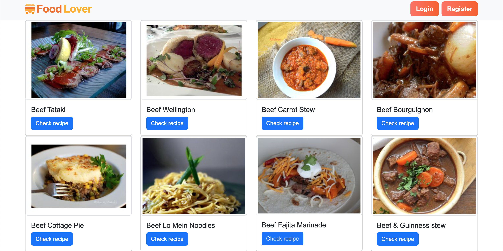
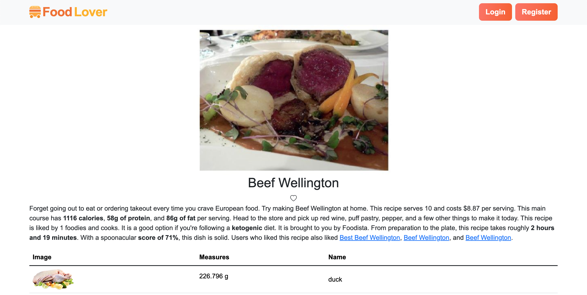
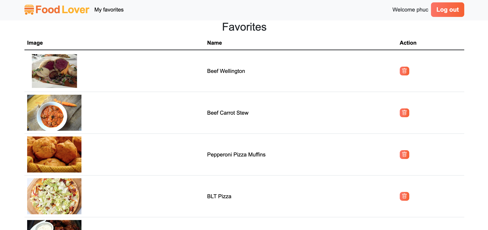

# FoodLover

#### Video Demo:  <https://youtu.be/9sDvZ55uJhg>
#### Description:
This project is developed as final project for Harvard University's CS50x Introduction to Computer Science Course, in November 2023.

The FoodLover website is designed to cater to enthusiasts who revel in the joy of culinary exploration. It facilitates users in searching for delectable recipes while offering the convenience of saving their favorites for future reference.

Main idea of the project is inspired from [Hany's CS50 Final Project: Recifilter](https://youtu.be/pKWqBQl-LmM) - a tutorial video that served as a wellspring of inspiration as I navigated through the conceptualization phase before embarking on the final project.

#### Preview:

Witness the visual allure of FoodLover through these snapshots:

#### Features:

FoodLover boasts a range of features designed to enhance the user experience:

- Login/Register User: Seamlessly create an account or log in to unlock personalized features.
- Recipe Search: Effortlessly explore a plethora of recipes to suit your culinary desires.
- Recipe Information: Dive into detailed information for each recipe, empowering users with insights into ingredients, preparation steps, and more.
- Favorites List: Create a curated collection of preferred recipes by adding them to your favorites list.

#### Technologies:

The technological backbone of FoodLover is a blend of cutting-edge languages and frameworks:

- Languages: HTML, CSS, JavaScript, Python, SQL
- Framework: Flask

## Misc

This project is developed solely by myself as a final project for Harvard University's <a href="https://cs50.harvard.edu/x/2023/">CS50x Introduction to Computer Science Course</a>. t is important to note that this project serves purely educational purposes, devoid of any commercial or monetary motivations.

> "I have to say this was, is, and will always be CS50 - the best course I've ever taken."

Special thanks to Harvard University, Prof. David J. Malan, and the entire staff for their invaluable contributions to my learning journey.

## Contact

Thank you for exploring this project and immersing yourself in the simulation. Your interest is deeply appreciated.

Please do not hesitate to contact me if you have questions regarding the project or any other related subject. Mail me <a href="mailto:phuc.dinhngoc.7@gmail.com">here</a>.
